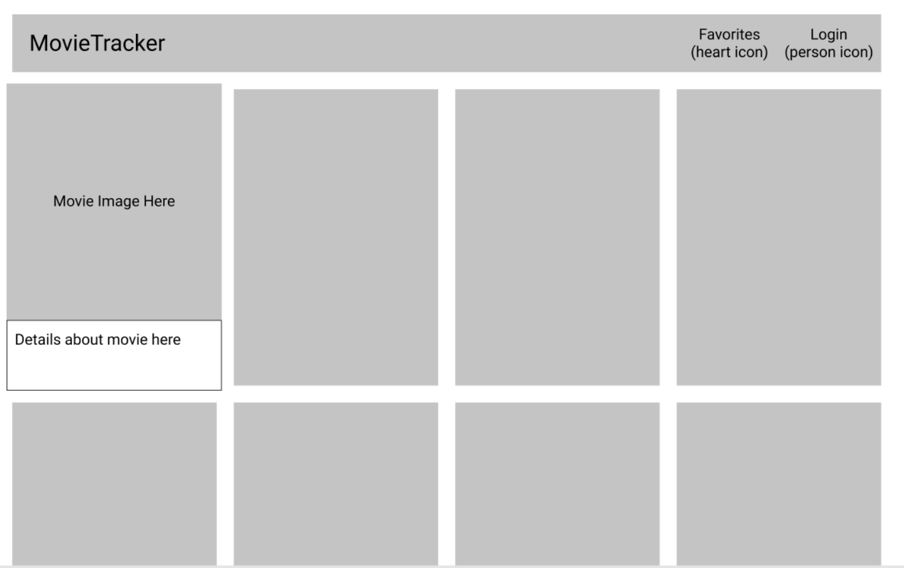
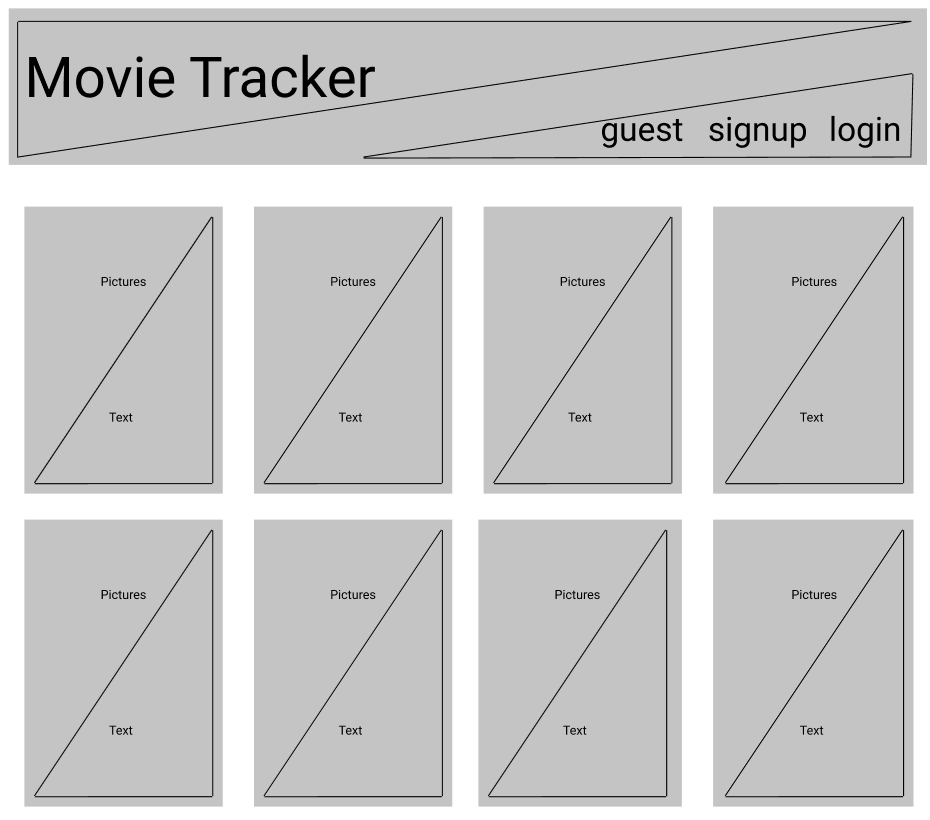
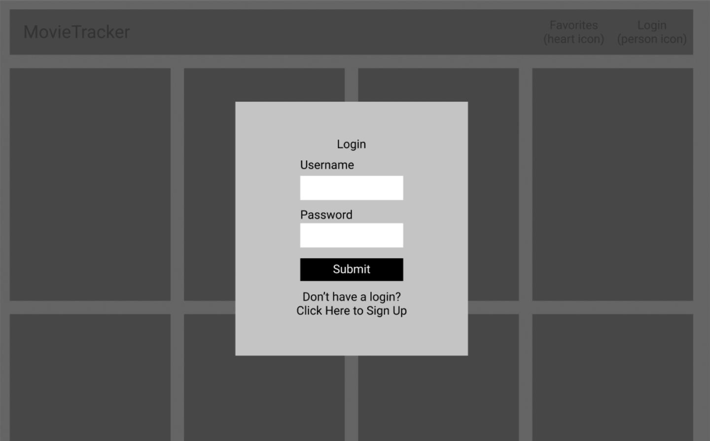

# Movie Tracker
#### An application for perusing movies

### Set-Up Back-End
Clone back-end repo: ```git clone https://github.com/turingschool-examples/movie-tracker.git```
Run ```npm install``` from root directory
Run ```npm start```

### Set-Up Front-End
Clone this repo: ```git clone git@github.com:kaohman/movie-tracker-app.git```
Run ```npm install``` from root directory
Run ```npm start``` and visit localhost:3001 in your browser

#### Background/About
This is a Movie Tracker app where users can view popular movies and sign-in to track their favorites. This project was our first app using Redux, React Router, and making fetch calls to a Postgres database. View original assigment [here](https://github.com/turingschool-examples/movie-tracker).

#### Screenshots
...images....

### Primary Technologies Used
- ReactJS
- Redux
- React Router
- Jest
- Enzyme
- SASS/SCSS
- MovieDB API
- Postgres

### Testing:
Jest and Enzyme for front-end testing.
Run npm test from the root directory

#### Enhancements
- Deploy website on Heroku
- Functionality to allow user to remain signed in on page refresh
- Regular expressions on email inputs so only valid emails are accepted

## Contributors
[Karin Ohman](https://github.com/kaohman)
[Travis Gee](https://github.com/geet084)

### Wireframes



